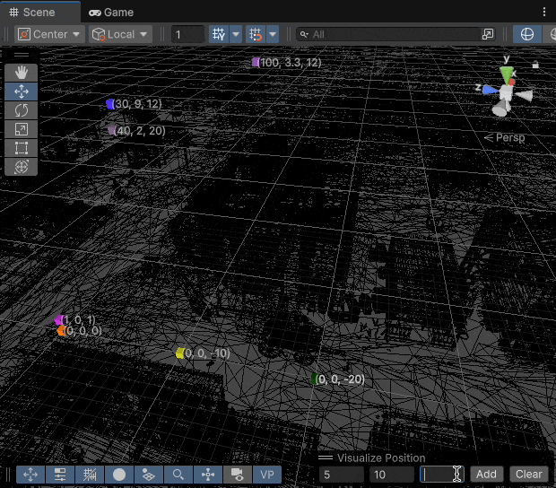
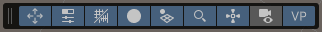
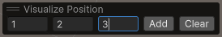
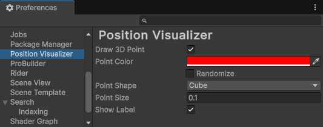

# Position Visualizer

A Unity utility to visualize positions in the scene view. Debug spatial
relationships, visualize algorithm outputs, or mark important positions in your
scene.




## Installing

Add the package to your project via
[UPM](https://docs.unity3d.com/Manual/upm-ui.html) using the Git URL:

```
https://github.com/mminer/position-visualizer.git
```

1. Open the Package Manager window in Unity (*Window > Package Manager*)
2. Click the "+" button in the top-left corner
3. Select "Install package from git URL..."
4. Enter the above Git URL
5. Click "Install"

Alternatively, add the following line to your `Packages/manifest.json` file:

```json
{
  "dependencies": {
    "com.matthewminer.position-visualizer": "https://github.com/mminer/position-visualizer.git",
    ...
  }
}
```

You can also clone the repository and point UPM to your local copy.


## Using

After installing the package, the **VP** (Visualize Position) button
appears in the scene view toolbar. Click this to open the overlay.



From the overlay, add points by entering X, Y, and Z coordinates and clicking
"Add". Click "Clear" to remove all points.



Points are automatically saved to EditorPrefs and restored when Unity restarts.
Visualized points are editor-only and will not affect builds.


### Scripting API

You can also add points programmatically.

```csharp
using PositionVisualizer;

...

Points.Add(
    new Vector3(1, 0, 0),
    new Vector3(0, 4, 0),
    new Vector3(6, 0, 2)
);

Points.Clear();
```


## Preferences

The appearance of points — color, size, and so forth — can be customized in the
*Position Visualizer* section of Unity's preferences.



- **Draw 3D Point**: Toggles between constant size or distance-scaled points
- **Point Color**: Sets the default color for points
  - **Randomize**: When enabled, assigns random colors to new points
- **Point Shape**: Displays points as cubes or spheres
- **Point Size**: Adjusts the size of points
- **Show Label**: Toggles whether to show the point's coordinates
